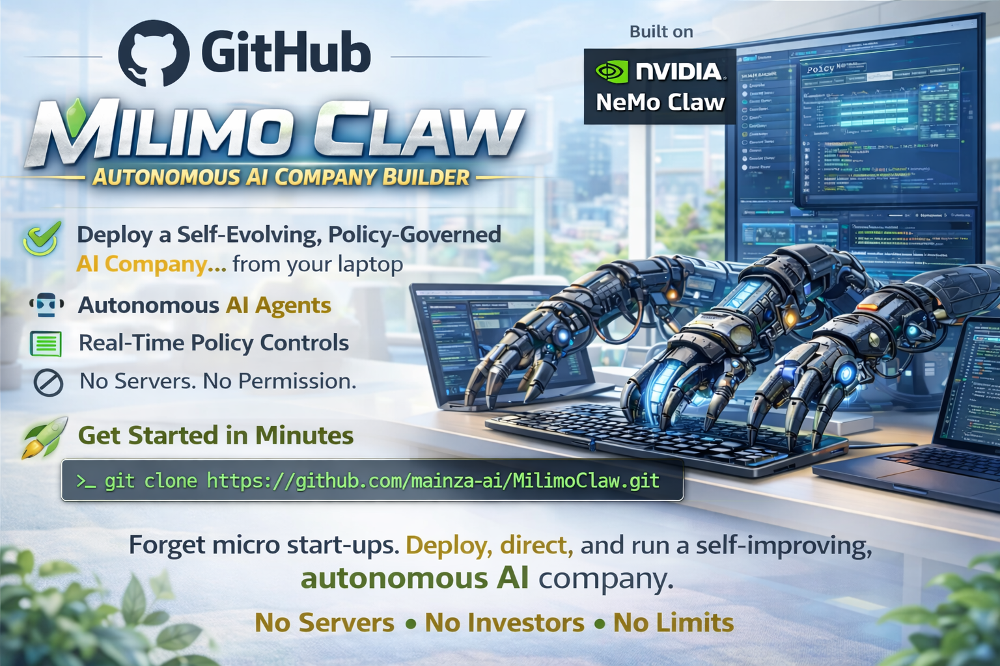

# 🦀 Milimo Claw

<p align="center">
  
</p>

<p align="center">
  <strong>An Autonomous Multi-Agent Hustle Mesh Built on NVIDIA NemoClaw</strong>
</p>

<p align="center">
  <a href="LICENSE"></a>
  <a href="https://github.com/NVIDIA/NemoClaw"></a>
  <a href="https://github.com/mainza-ai/MilimoClaw/actions"></a>
  <a href="https://github.com/mainza-ai/MilimoClaw/releases"></a>
</p>

> *"Your friend group is a startup. Your laptops and cloud nodes are the infrastructure. Your claws do the work."*

---

**Milimo Claw** (derived from the Tonga word for *"works," "tasks," or "labour"*) is a multi-agent autonomous hustle platform built on [NVIDIA NemoClaw](https://github.com/NVIDIA/NemoClaw). It turns a squad of operators running NemoClaw sandboxes into a coordinated, self-evolving, AI-powered business operation that runs 24/7.

### 🎯 Choose Your Profile

MilimoClaw runs on **NemoClaw** with two profiles sharing a single `milimo-core` library:

| Profile | Interface | Parallelism | Scheduling | Best For |
|---------|-----------|-------------|------------|----------|
| **OpenClaw** (default) | TUI + Bridge Server | `sessions_spawn` (depth ≤ 2) | Python `threading.Timer` | Solo operators, local development, terminal-native users |
| **Hermes** | Web Dashboard (:18790) + OpenAI API (:8642) | Native `delegate_task` (no depth limit) | Native `cronjob` (durable) | Teams, CI/CD, headless servers, managed tool gateways |

**Quick guide**:

```
Need web search / browser automation / image gen / audio?
  → Use Hermes + Nous Portal OAuth (--auth-mode nous_oauth)

Need durable scheduled jobs that survive restarts?
  → Use Hermes (native cronjob)

Running CI/CD or headless server?
  → Use Hermes (non-interactive onboarding, OpenAI-compatible API)

Want zero-config solo setup on your laptop?
  → Use OpenClaw (`./install.sh --solo`)
```

### 💡 Solo Operator Mode

For solo founders and edge developers, **Solo Mode** runs all six autonomous claws concurrently within a single sandboxed environment (any GPU-enabled PC for local inference, or any CPU/GPU system with cloud connections). Delivers the full power of a multi-agent mesh without cluster overhead.

### Stateful Process Supervision

Equipped with **Lucy** (the Assistant Claw) acting as the system orchestration harness:
* **E2E Stall Detection**: Lucy dynamically polls active processes across isolated sandbox pathways.
* **Dual-Delivery Alerts**: When a milestone stalls or times out, Lucy writes conversational warnings to chat channels and injects high-priority `ActionPriority.HOLD` alerts directly into the **Solo War Room TUI**.
* **Intelligent Diagnostics**: Standardized under seccomp-friendly `assistant_query` payloads, Lucy can actively prompt any worker claw for its current REVIEW/HOLD queue sizes and recent operational log snippets.

### Background Task Pipelines

The mesh resolves complex requests asynchronously through standalone pipelines:
* **Threaded Execution**: Worker claws spawn background threads (`build-assistant-task-pipeline`) to resolve engineering sprint issues and deliver code modifications without blocking the inter-sandbox polling queues.
* **Offline Resilience**: The pipeline wraps Git CLI operations in structured try-except blocks, ensuring local execution succeeds even when unauthenticated or offline.
* **Premium Local Fallback Mocks**: If remote NIM APIs are unreachable under sandbox network isolation, the inference client falls back to local mocks, including a pre-seeded, fully playable Pygame Tetris game code generator.

### Dynamic Startup Latency Reduction

Startup and polling wait delays are minimized for sandboxed environments:
* **Signal Polling**: The build claw polls the analytics claw weekly signals using directory-checking loops rather than arbitrary timeouts.
* **Sandbox Calibration**: Polling wait delays scale down from 5 minutes (`300s`) in production to `1.0` second in development and integration test scopes, improving testing feedback loops.

### Claw File Sync

Developers can easily access and view files generated by the claws.
The sync system uses profile-based path resolution:

| Profile | Claw Root Path |
|---------|---------------|
| **OpenClaw** (default) | `/sandbox/.openclaw/milimo/claws/{role}/` |
| **Hermes** | `/sandbox/.hermes/claws/{role}/` |

**Host Extraction** (`scripts/hermes-sync.sh`): Extracts invoices, draft posts, source code, and other claw outputs from a running Hermes sandbox to the host:

```console
# Sync all claws to ./claws_data/
$ ./scripts/hermes-sync.sh

# Sync only the finance claw
$ ./scripts/hermes-sync.sh --role finance

# Sync to a custom output directory
$ ./scripts/hermes-sync.sh --output /tmp/my-claws

# Watch mode: sync every 5 minutes
$ ./scripts/hermes-sync.sh --watch --interval 300

# Archive as tarball
$ ./scripts/hermes-sync.sh --archive --output ./claws-export.tar.gz

# Dry run (show what would sync without copying)
$ ./scripts/hermes-sync.sh --dry-run
```

**Sandbox Inventory** (`hermes-inventory.py`): List all claw files with metadata from inside the sandbox:

```console
$ nemohermes milimo-hermes exec -- python3 /opt/hermes/scripts/hermes-inventory.py
$ nemohermes milimo-hermes exec -- python3 /opt/hermes/scripts/hermes-inventory.py --role finance --pattern '*.json'
```

**Git Security**: The `claws_data/` directory is registered in the workspace `.gitignore` file to ensure client records and developer assets are kept secure.

### Agent-Initiated Spend (Stripe Link CLI)

Claws can request to buy things through the Finance Claw using the Hermes `stripe-link-cli` skill — double-gated so no purchase happens without your explicit approval:

1. **Stage 1 — REVIEW**: A claw (Build, Ops, Content, etc.) sends a `spend_request` message. The operator sees the purchase in the War Room (`. Wagner review` — what, why, how much).
2. **Stage 2 — HOLD**: The operator presses `R` to release the hold. `SpendApprovalHandler.handle_hold_release()` runs `link-cli spend-request create --no-request-approval` (non-blocking), then fires a separate `link-cli spend-request request-approval <lsrq_id>` to push the notification to the user's phone, then starts background polling — all without freezing the War Room TUI.
3. **Link App Approval**: The charge only completes when you tap **Approve** in the Link app. Hermes cannot self-approve at any step.

```console
# Install the skill (Hermes sandbox) — --yes for non-interactive/Docker builds
$ hermes skills install --yes official/payments/stripe-link-cli

# Set daily spend cap (default $100)
$ export MILIMO_DAILY_SPEND_CAP_CENTS=10000

# Link CLI is baked into the Docker image at v0.8.2
# Test mode is enabled by default (MILIMO_SPEND_TEST_MODE=true)
```

#### Demo / Test Mode Spend Flow

For testing the spend flow in `test-mode` without using real money, copy and use the entire prompt below:

```text
Demo Finance Claw Stripe Link test-mode spend flow.

Do not use real money. All Stripe calls must include --test.

1) Verify environment
   - Check that link-cli is available (which link-cli)
   - Confirm MILIMO_SPEND_TEST_MODE is set in this sandbox environment

2) List available test payment methods
   Run: link-cli payment-methods list --format json
   If the list is empty, tell me to add a test card at app.link.com/wallet
   (card: 4242 4242 4242 4242, any future expiry, any CVC)

3) Fetch the first payment method ID from the list and store it in the variable PM_ID

4) Submit a spend review request via the Finance Claw skill
   Use the SpendApprovalHandler / SpendWarRoomBridge path (not raw shell):
   - Requesting claw: build-claw
   - Merchant: Vercel
   - Merchant URL: https://vercel.com
   - Amount: 2000 cents ($20.00)
   - Justification: "Provision preview environment for MilimoVPN demo"
   - Payment method: $PM_ID

5) Auto-approve the REVIEW step (operator == "system") to move it into HOLD.

6) Release the HOLD through SpendApprovalHandler.handle_hold_release(hold_action_id).
   This runs create --no-request-approval, then a separate request-approval <id>,
   then background retrieve polling. Do NOT run link-cli spend-request create
   with --request-approval directly — that fires a second approval notification.

7) Report back:
   - spend_id created
   - link_spend_request_id returned (lsrq_...)
   - Whether the command exited 0
   - The full json payload
   - Confirm the --test flag was present in the command
```

**Web Search / Browser Automation / Image Gen / Audio**: Use Hermes + Nous Portal OAuth (`--auth-mode nous_oauth`)

**Stripe Purchases / SaaS Provisioning / Per-Request APIs**: Install `stripe-link-cli` skill — agent-initiated purchases via Finance Claw double-gate.

### Native Memory & Context Calibration

The platform maintains infinite conversation execution loops without prompt ceiling crashes:
* **Context Bounding**: registers the provider-level `contextWindow` at **`65536`** (64k) tokens in `openclaw.json` to match hosted NVIDIA NIM API physical limitations.
* **Context Pruning**: Injects native `contextPruning` rules under `agents.defaults` to trim non-essential tool outputs and prune cached inputs after 4 hours.
* **Safeguard Compaction**: Triggers native `compaction` loops and background memory synthesis turns (`memoryFlush`) at a soft threshold of `4096` tokens from limits, writing state summaries directly to `SOUL.md` / `soul.md` via `NO_REPLY` silent turns.

---

## The Six Autonomous Claws

Each claw runs inside its own highly isolated NemoClaw sandbox with kernel-level seccomp, Landlock, and dropped capability protections. Claws communicate through typed inter-sandbox message contracts enforced by the **OpenShell Gateway**.

Paths resolve automatically based on `MILIMO_PROFILE`:
- **OpenClaw**: `/sandbox/.openclaw/milimo/claws/{role}/`
- **Hermes**: `/sandbox/.hermes/claws/{role}/`

| Claw | Specialty Role | Sandbox Path |
| :--- | :--- | :--- |
| 🎨 **Content Claw** | Creative Department — posts, copy, campaigns | `<profile>/claws/content/` |
| 📋 **Ops Claw** | Account & Project Management — health, briefs, risk | `<profile>/claws/ops/` |
| 📊 **Analytics Claw** | Intelligence Layer — reports, anomalies, scores | `<profile>/claws/analytics/` |
| 💰 **Finance Claw** | Financial System — invoicing, pricing, tax | `<profile>/claws/finance/` |
| 🔧 **Build Claw** | Engineering — PRs, code, deploys, audits | `<profile>/claws/build/` |
| 🤖 **Assistant Claw (Lucy)** | Operator Bridge — supervision, routing, coordination | `<profile>/claws/assistant/` |

Profile detection is automatic via `MILIMO_PROFILE` env var. Layouts are defined centrally in `milimo-core/src/milimo_core/claw_layouts.py`.

---

## 📚 The Milimo Knowledge Vault (Obsidian-Powered)

To coordinate and govern a high-leverage multi-agent system, you need a living, interlinked knowledge base. Inside [milimo-claw-wiki/](./milimo-claw-wiki) lives a fully structured, **Obsidian-ready markdown vault** designed on Andrej Karpathy's LLM Wiki pattern.

It serves as the **ultimate source of truth** for human operators and AI assistants alike:

* **Interactive Graph Visualization**: Load the vault into [Obsidian](https://obsidian.md/) to inspect the full agent topology, message contracts, and data-flow pathways visually via the interactive Graph View.
* **LLM-Optimized Architecture**: The vault features an AI-first structure (curated in [CLAUDE.md](./milimo-claw-wiki/CLAUDE.md)) with strict metadata schemas, tags hierarchies, and ground-truth validation rules, allowing LLMs to absorb the complete system context in seconds.
* **Comprehensive Knowledge Base**:
  * 🔒 **Security & Policies**: Documents kernel-level seccomp boundaries, Landlock constraints, and the privacy router.
  * 💬 **Coordination Matrix**: Explains the 27 typed inter-claw message contracts, sequencing rules, and approval modes.
  * 🌱 **Self-Evolution Logs**: Tracks autonomous Sunday tool-generation outcomes, baseline calibrations, and complexity scores.

*To explore the vault locally, simply open the [milimo-claw-wiki/](./milimo-claw-wiki) directory inside Obsidian.*

---

## Quick Start

### Prerequisites

* **NemoClaw**: Core sandboxing runtime (install prior to initializing Milimo Claw)
  ```console
  $ curl -fsSL https://www.nvidia.com/nemoclaw.sh | bash
  ```
* **OS**: macOS (Apple Silicon), Linux (Ubuntu 22.04+ recommended), or Windows with WSL2.
* **Containers**: Docker Engine and Docker Compose.
* **Runtime**: Node.js 22.16+ & Python 3.11+.
* **Credentials**:
  - NVIDIA API Key — [build.nvidia.com](https://build.nvidia.com/) (Required for local or cloud NIM inference).
  - GitHub Personal Access Token (Required for Build Claw automation).

### Installation & Onboarding

#### Option A: OpenClaw Profile (Default)

To run the standard OpenClaw installation, execute:

```console
$ export NVIDIA_API_KEY=nvapi-your-key-here
$ export GITHUB_TOKEN=github_pat_your-token-here
$ git clone https://github.com/mainza-ai/MilimoClaw.git
$ cd MilimoClaw
$ cp .env.example .env
$ ./install.sh --solo --operator-name "your-name" --squad-name "your-squad" --non-interactive
$ nemoclaw my-assistant connect
$ openclaw tui
```

#### Option B: Hermes Profile (Web Dashboard + OpenAI-compatible API)

To run the Hermes profile with web dashboard (port 18789) and OpenAI-compatible API (port 8642):

```console
$ export NVIDIA_API_KEY=nvapi-your-key-here
$ export GITHUB_TOKEN=github_pat_your-token-here
$ export NEMOCLAW_NON_INTERACTIVE=1
$ export NEMOCLAW_ACCEPT_THIRD_PARTY_SOFTWARE=1
$ git clone https://github.com/mainza-ai/MilimoClaw.git
$ cd MilimoClaw
$ cp .env.example .env
$ ./milimo-hermes-sandbox/install-hermes.sh --non-interactive
$
$ # Or interactive install (prompts for auth mode, Slack channels, etc.)
$ ./milimo-hermes-sandbox/install-hermes.sh
$
$ # Or manually onboard using the Dockerfile
$ nemohermes onboard --name milimo-hermes --from ./milimo-hermes-sandbox/Dockerfile
```

**Headless / CI build** (no TTY, skip backup step that hangs on sealed files):

```bash
NEMOCLAW_RECREATE_WITHOUT_BACKUP=1 \
NVIDIA_API_KEY="$(grep NVIDIA_API_KEY .env | cut -d= -f2)" \
NEMOCLAW_NON_INTERACTIVE=1 \
NEMOCLAW_ACCEPT_THIRD_PARTY=1 \
NEMOCLAW_AUTH_MODE=api_key \
  ./milimo-hermes-sandbox/install-hermes.sh --non-interactive
```

> **Note**: `NEMOCLAW_RECREATE_WITHOUT_BACKUP=1` is required when running non-interactively. Without it, the build hangs at the shields-backup step because sealed files cannot be read by the backup process. After rebuild, the post-onboarding script sets up port forwarding automatically (dashboard on 18790, war room on 9090).

**Policy presets** (applied automatically by `install-hermes.sh` post-onboarding):

The install script applies network policy presets from `milimo-blueprint/policies/presets/` via `nemohermes policy-add --from-dir`. Each preset whitelists external hosts required for real-world functionality. If any preset fails to apply, the sandbox will block those URLs at the OpenShell proxy layer.

| Preset | Hosts added | Purpose |
|--------|-------------|---------|
| `npm` | `registry.npmjs.org`, `registry.yarnpkg.com` | Package installs inside sandbox |
| `pypi` | `pypi.org`, `files.pythonhosted.org` | Python package installs |
| `huggingface` | `huggingface.co`, `cdn-lfs.huggingface.co`, `router.huggingface.co` | Model downloads |
| `brew` | `formulae.brew.sh`, `github.com`, `ghcr.io`, `pkg-containers.githubusercontent.com`, `objects.githubusercontent.com`, `raw.githubusercontent.com` | Homebrew + GitHub CLI |
| `nous-portal` | `portal.nousresearch.com:443`, `inference-api.nousresearch.com:443` | Nous Portal OAuth + managed tool gateways |
| `stripe-link` | `api.link.com`, `login.link.com`, `app.link.com` | Stripe Link CLI device-code auth + spend requests |
| `stripe` | `api.stripe.com` | Invoice creation, customer lookup, payment monitoring |
| `sentry` | `sentry.io`, `*.ingest.sentry.io` | Error reporting |
| `vercel` | `api.vercel.com` | Deploy status + project management |

**Verify all presets applied**:
```bash
nemohermes milimo-hermes policy-list
# Must show: npm, pypi, huggingface, brew, nous-portal, stripe-link, stripe, sentry, vercel
```

If any preset is missing (collision or apply failure), apply individually:
```bash
for f in milimo-hermes-sandbox/milimo-blueprint/policies/presets/*.yaml; do
  nemohermes milimo-hermes policy-add --from-file "$f" --yes 2>&1 || true
done
```

> **Critical**: If `nous-portal`, `stripe-link`, or `stripe` presets are not active, the sandbox proxy will block those hosts and the corresponding features (OAuth login, spend flow, invoicing) will fail with connection errors.

**Post-onboarding manual steps** (run inside the sandbox):
```bash
# Login to Stripe Link CLI (required before first spend request)
nemohermes milimo-hermes exec -- link-cli auth login

# Add a test payment method at app.link.com/wallet
# (card: 4242 4242 4242 4242, any future expiry, any CVC)
```

**Result:**
- Web Dashboard: `http://localhost:19119/`
- OpenAI-compatible API: `http://localhost:8642/v1`
- War Room: `http://localhost:9090/warroom.html` (HTMX server, auto-started in container)
- Headless: SSH tunnel `ssh -L 19119:127.0.0.1:19119 user@host` or set `CHAT_UI_URL=http://localhost:18790`

> **Note**: The Hermes dashboard is served internally on port **19119** inside the sandbox. The installer may reference `18789`/`18790` in its text output, but the actual listening port is `19119`. Verify with `openshell forward list` and `curl http://127.0.0.1:19119/` — it must return `HTTP 200`. If the dashboard is unreachable, run `openshell forward start --background 19119 milimo-hermes` to create the correct forward.

> **Port forwarding**: `nemohermes onboard` maps ports `19119` (dashboard) and `8642` (API) automatically. If port 19119 is not listed in `openshell forward list`, start it manually: `openshell forward start --background 19119 milimo-hermes`.

> **Two-container conflict**: `nemohermes onboard` may create a plain Hermes sandbox (`openshell` container) before `install-hermes.sh` creates `milimo-hermes`. If you see port conflicts, destroy the plain Hermes sandbox first: `nemohermes openshell destroy`.

> **Gateway daemon race (fixed 2026-07-09)**: Earlier builds started `gateway-daemon.sh` from both `~/.bashrc` and `~/.profile` in addition to `start.sh`. That spawned two independent supervisors for `hermes gateway run`, causing port 18642 conflicts, Telegram `getUpdates` `Conflict` errors, and unbounded thread accumulation. The daemon hooks have been removed from `.bashrc`/`.profile` and the boot `init.d` registration. `start.sh` is now the sole gateway manager. If `ps aux | grep hermes.real` shows more than 2 processes (gateway + dashboard) or you see `SUPERVISOR_UNAVAILABLE`, rebuild: `./milimo-hermes-sandbox/install-hermes.sh --non-interactive --recreate-sandbox`.
>
> **War room not starting (fixed 2026-07-09)**: If `http://127.0.0.1:9090/warroom.html` returns connection refused or the page has no approve/release/veto buttons, two bugs in `warroom/server.py` startup were preventing the server from binding to port 9090: (1) `start.sh` used `/usr/bin/python3` instead of the venv interpreter (`$_HERMES_PYTHON`) — `ModuleNotFoundError: No module named 'milimo_core'`; (2) `server.py` used `dict[str, Any]` without importing `Any` from `typing` — `NameError` on Python 3.13. Both fixed in commit `be62e42`. Rebuild to activate: `./milimo-hermes-sandbox/install-hermes.sh --non-interactive --recreate-sandbox`. The war room (port 9090) is a standalone HTMX server, not embedded in the dashboard (port 18790/19119) — go directly to `http://127.0.0.1:9090/warroom.html`.

##### Troubleshooting: `connect` Hangs / `relay open timed out`

If `nemohermes milimo-hermes connect` hangs or every command returns `relay open timed out`, the baked sandbox auth token has expired.

**Quick triage**:
```bash
# 1. Try recover first
nemohermes milimo-hermes recover

# 2. If still failing, destroy and re-onboard
nemohermes milimo-hermes destroy --cleanup-gateway --yes
nemohermes onboard \
  --name milimo-hermes \
  --from ./milimo-hermes-sandbox/Dockerfile \
  --non-interactive \
  --yes \
  --yes-i-accept-third-party-software \
  --fresh \
  --recreate-sandbox
```

**Root cause**: The static auth token baked at build time expires. `gateway restart` and `recover` restart the gateway *process* but cannot rotate a static baked token. This will recur periodically until NemoClaw supports automatic token rotation for baked tokens.

##### Troubleshooting: `milimo_status` / Milimo tools not appearing in chat

**Symptom**: Inside Hermes chat, agent falls back to shell, reports `plugin dependency milimo_core is not installed`, or no `milimo_*` tools appear at all.

**Root cause (two bugs)**:
1. `milimo-hermes-sandbox/milimo-blueprint/policies/presets/npm.yaml` used `preset.name: npm`, which collides with a built-in nemohermes preset. `nemohermes policy-add --from-dir presets/` aborts on collision, silently skipping every preset that comes after `npm.yaml` in directory order — including `nous-portal`, `sentry`, `stripe`, `stripe-link`, and `vercel`.
2. `install-hermes.sh` wrapped the batch `policy-add --from-dir` in a single `if/then/else`, so one failure killed the entire preset load.

**Fixed**: `preset.name` in `npm.yaml` renamed to `milimo-npm`; `install-hermes.sh` now applies each preset individually so one failure cannot block the rest.

**Quick recovery for a running sandbox** (apply each preset file individually):
```bash
for f in milimo-hermes-sandbox/milimo-blueprint/policies/presets/*.yaml; do
  nemohermes milimo-hermes policy-add --from-file "$f" --yes 2>&1 || true
done
nemohermes milimo-hermes policy-explain | grep -A2 "nous-portal"
# must show status: verified
```
```

### Agent-Initiated Spend (Stripe Link CLI) —missing tool wiring fix

**Symptom**: Inside Hermes chat, agent ends with `I’m blocked on step 4: the specific Finance Claw micro-layer (SpendApprovalHandler / SpendWarRoomBridge) is not exposed in this sandbox`, and a `sudo` password prompt appears.

**Root cause**: `milimo-hermes-plugin/milimo_hermes_plugin/tools.py` did not expose the Finance Claw spend flow. `register_core_tools()` registered only `milimo_status`, `milimo_warroom`, `milimo_approve`, `milimo_veto`, `delegate_task`. The capability string `request_agent_spend` was declared, but there was no `MILIMO_SPEND_SCHEMA` / `handle_milimo_spend` to invoke `SpendApprovalHandler`.

When tool discovery failed, the agent fell back to shell filesystem inspection, hit root-owned paths under `/opt/milimo-core/src/`, and Hermes auto-escalated to `sudo`. In non-interactive chat that prompt cannot be answered, so it timed out.

**Fixed**: Added `milimo_spend` tool to `tools.py`:
- `MILIMO_SPEND_SCHEMA` with actions: `queue_review`, `approve_review`, `block_review`, `release_hold`, `cancel_hold`, `status`
- `handle_milimo_spend()` routing to `SpendApprovalHandler`
- Registration in `register_core_tools()`

**See also**: [[common-issues]] — Hermes sudo-prompt / missing spend tool entry

### Day-to-Day Operations

Once the Hermes sandbox is running, use these commands:

#### Start a Chat Session
```console
$ nemohermes milimo-hermes connect
```

#### Check Gateway Status
```console
$ nemohermes milimo-hermes status
```

#### View War Room

The War Room is served automatically by the container at `http://localhost:9090/warroom.html` on host port 9090. No manual server start is needed:

```console
$ curl http://localhost:9090/health
# Expected: {"status": "ok"}
```

> **Note**: Port `9090` is the default for the HTMX War Room server and is forwarded automatically when the container starts. Port `8080` is reserved for the OpenClaw/OpenShell gateway. If port 9090 is not responding, verify the forward with `openshell forward list` and check container logs: `nemohermes milimo-hermes logs`.

#### Check Sandbox Logs
```console
$ nemohermes milimo-hermes logs -n 50
```

#### Change Model / Inference Provider
```console
$ nemohermes inference set --model stepfun-ai/step-3.7-flash --provider nvidia-nim --sandbox milimo-hermes
```
> `openshell inference set` is not available inside Hermes sandboxes. Always use `nemohermes inference set` from the host.

#### Use Nous Portal Models (Managed Tool Gateways)
Connect to Nous Portal for 300+ models and managed tool gateways (web search, browser automation, image generation, TTS, audio processing):

Run inside the sandbox with a TTY (interactive OAuth flow):
```console
$ nemohermes milimo-hermes exec --tty -- hermes setup --portal
```

**Prerequisite**: The sandbox network policy must allow `portal.nousresearch.com:443`. The `nous-portal` preset is applied automatically during `install-hermes.sh` (post-onboarding). To apply manually:
```console
$ nemohermes milimo-hermes policy-add --from-dir milimo-blueprint/policies/presets/ --yes
```

#### Check Inference Config
```console
$ nemohermes inference get --json
```

#### Run Commands Inside Sandbox
```console
$ nemohermes milimo-hermes exec -- hermes gateway status
$ nemohermes milimo-hermes exec -- hermes skills list
```

**Auth Modes:**
- `api_key` (default): Standard NVIDIA inference
- `nous_oauth`: Nous Portal OAuth — enables managed tool gateways (web search, browser automation, image generation, audio processing, managed code execution)
  - Use `--auth-mode nous_oauth` or `export NEMOCLAW_AUTH_MODE=nous_oauth`

---

## Command Reference

### Platform Commands

Manage the sandboxes and squad deployments:

```console
$ openclaw milimo warroom
$ openclaw milimo squad status
$ openclaw milimo blueprint list
$ openclaw milimo blueprint fork <source-blueprint-id>
$ openclaw milimo blueprint publish
```

### Chat Shortcuts (Inside OpenClaw TUI)

Type these commands directly inside the TUI conversation stream:
* `/milimo status` — Check heartbeats and health metrics across the mesh.
* `/milimo roles` — List active operational permissions.
* `/milimo mesh` — Display visual inter-sandbox gateway topology.
* `/milimo help` — Retrieve the comprehensive interactive handbook.

---

## Architecture & Security Blueprint

```
 ┌──────────────────────────────────────────────────────────────────────────────┐
 │                                MILIMO MESH TUI                               │
 │                                                                              │
 │ [Content Claw]  [Ops Claw]  [Analytics]  [Finance Claw]  [Build Claw]        │
 │    Sandboxed     Sandboxed   Sandboxed     Sandboxed      Sandboxed          │
 │                                                                              │
 │        ▲             ▲           ▲             ▲              ▲              │
 │        │             │           │             │              │              │
 │        └─────────────┼───────────┴─────────────┼──────────────┘              │
 │                      ▼                         ▼                             │
 │                         [OpenShell Gateway Store]                            │
 │                       (Typed Message Contract Bus)                           │
 │                                  ▲                                           │
 │                                  │                                           │
 │                                  ▼                                           │
 │                     [Lucy Stateful Orchestrator] ◄──► [Solo War Room TUI]    │
 │                     (Assistant Sandbox Harness)        (Dashboard HOLD Alerts)│
 └──────────────────────────────────────────────────────────────────────────────┘
```

* **Zero-Trust File Isolation**: Sandboxes cannot traverse sibling filesystems. All interaction occurs strictly via typed contracts over localhost gateway sockets.
* **Privacy Router**: Sensitive credentials and operational variables are held in the OpenShell Gateway Store. Local classification filters automatically redact client records and source files.
* **Continuous Self-Evolution**: Claws analyze execution outcomes and autonomously write, test (via sandboxed Pytest backtesting), and register fresh Python tools every Sunday.

---

## CI/CD Pipeline Status

MilimoClaw uses GitHub Actions for continuous integration:

| Workflow | Status |
|----------|--------|
| **Hermes CI** (`hermes-ci.yml`) | ✅ Passing — `hermes-integration` (unit + integration + coverage gate) + `hermes-smoke` (Docker build + endpoint verification) |
| **Integration Tests** | 58 Hermes tests + 265 core tests + 1,234 blueprint tests = **1,557 total** |
| **Coverage Gate** | ✅ All `milimo-core` modules ≥80% |

The Hermes CI pipeline validates:
- Docker build using NVIDIA's public `ghcr.io/nvidia/nemoclaw/hermes-sandbox-base` image (fixed from private `ghcr.io/nousresearch/hermes-agent` 403 error)
- Config generation at build time (`generate-config.ts`)
- Plugin installation at `/sandbox/.hermes/plugins/milimo-hermes`
- Blueprint setup at `/sandbox/.nemoclaw/blueprints/0.1.0/`
- Health endpoints (`/opt/hermes/.milimo_install`, `milimo_core` importable, War Room assets)

---

## Testing and Quality Control

Milimo Claw enforces absolute type safety and robust validation protocols:

```console
$ cd milimo && npm test
$ .venv/bin/pytest milimo-core/tests/
$ .venv/bin/pytest milimo-hermes-plugin/tests/
$ cd milimo-blueprint && PYTHONPATH=.:orchestrator uv run pytest
```

---

## License & Creator

* **License**: Apache-2.0 — see [LICENSE](LICENSE).
* **Author**: **Mainza Kangombe** — [LinkedIn Profile](https://www.linkedin.com/in/mainza-kangombe-6214295)
